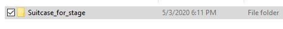
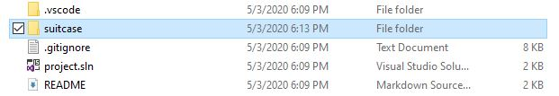
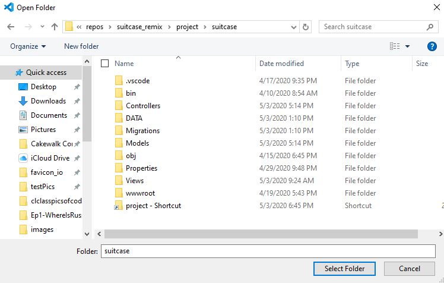
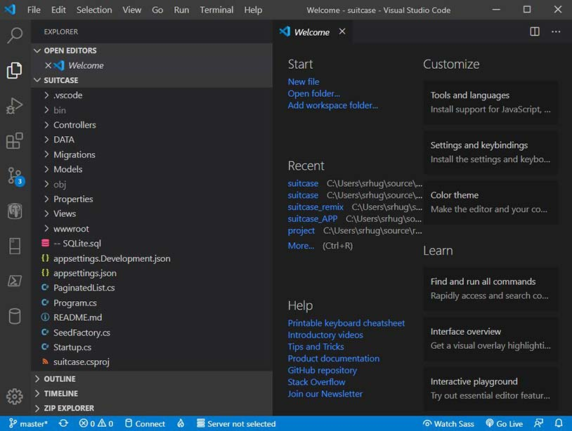
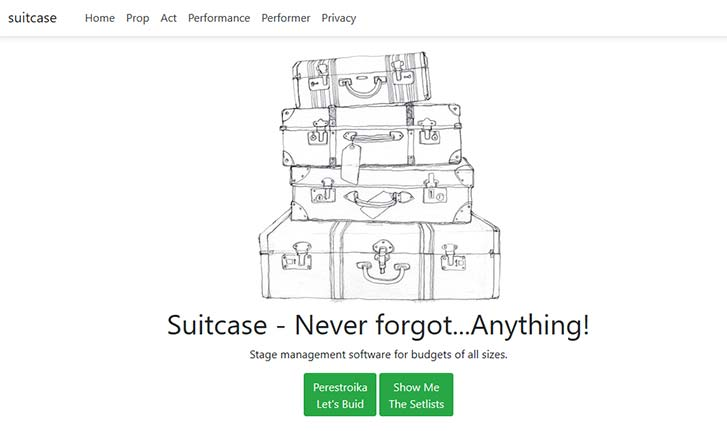

# suitcase  Stage Management Software

>Welcome to *suitcase*, stage managment software for budgets of all sizes. The intended use of *suitcase* to help small stage production companies stay organized, create setlists and manage props. At this time the prop library is not yet linked to the set list generator, that will be done in a future update.
>
>A Code Louisville Project  created, owned and maintained by Steven Hughes.

## suitcase is built using
>
- Asp.net Core using the MVC Design Pattern
- Sqlite
- Razor

## How to run suitcase

> suitcase is built for the web, in order to run it from your machine, you will need to clone it from GitHub and run it using Visual Studio or VSCode. These instructions will focus on using VSCode as it lightweight.
>
- If you have not already  [Download it from GitHub](https//github.com/stevenhughes08/Suitcase_for_stage)
- Or you can create an empty git repository by running the following code from a cmd line.
   `md suitcase`
   `cd suitcase`
   `git init`
   `git clone https//github.com/stevenhughes08/Suitcase_for_stage.git`

1. Open VSCode and navigate to the folder where you cloned or saved suitcase project. Open the suitcase folder.

1. Click the **Select Folder** button.

1. Your screen should look like the image below.

1. Click the Debug Button  and press the green play button  This will Launch *suitcase*.

1. Your browser should now be running suitcase.

## How to use *suitcase*

1. *suitcase* Core Features
    The core features of *suitcase* are Setlist builder and the prop library (which will be discussed later)
      - Click the green **Perestroika Let's Build** button. This will launch *suitcase*'s production builder. You must name your production, but you can always go back and change the name later if you need to.
    
2. Once you click the **Create** button you will be taken to the Performance Index page.
   >
   >If you want to view setlists for other performances you can click the **Details** tab in the column to your right. You can use the **Edit**, and **Delete** buttons to change and remove performances from your database. The **Create New** will allow you to add create a new Performance, but now lets Add Acts to your performance. Click the Green **Add Acts** button located at the bottom of the page.
3. Click the **Add Acts** button you will be taken to the Act Creator screen.
   >
   - You will be required to name your Act, that can always be changed later. However, currently you must select your Act by the Performance ID. This is not a user friendly implementation and will fixed in a later release. Once you have named your Act click **Create**.
4. Once you complete step 3 you will be taken to the Acts Index page. This will list all acts sorted by Performance. If at the bottom of the page you will find a green button labeled **Add or Edit Props.**  
   >
5. Once you click the **Add or Edit Props** button it will launch *suitcase*'s Prop Library.
   >
   >Much like all other screen you can perform **Create**, **Read**, **Update** and **Delete** functions on all the props you are storing. You can also search for each prop or storage location. You can use the **Create New** link to add more props and the **Previous** and **Next** buttons to Navigate the prop library.
6. Click the **View Your Setlist** button. This will navigate you back to the Performance Index page. Locate your **Performance** in the **Name** column and click **Details**. This will display the *Performance Index Page.*
    >
7. Once you click **View Your Setlist** you will see the *Performance Index* page. Click **Details**. This will allow you to view a setlist as shown in the image below. This will show a Performance and list of acts.

## Other Features

## *suitcase*'s button navigateion

- *suitcase* offsers navbar navigation.

- If at any point you require to navigate to any of *suitcase*'s other features you can use the navbar to break out of *suitcase*'s button navigation.
  
## Performer Tracking

- This feature is currently not active in the set list builder. However it will be added in future updates.

*suitcase*'s perfomer screen allows you to add a **Performer** and headshot url. This feature is not fully active at this time.

>Thank you for using *suitcase*.
